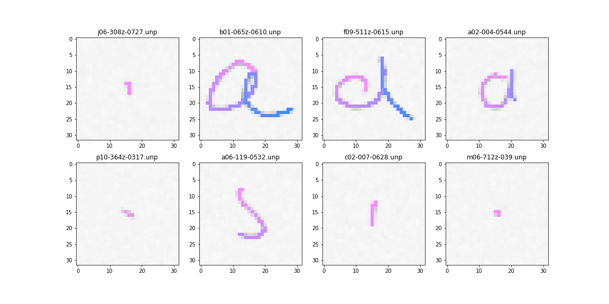

# TraTra

## Setup
### Environment
- Set up the pipenv environment via the following command
```bash
$ pipenv install --skip-lock --dev
```

- Download [IAMONLINE dataset](https://fki.tic.heia-fr.ch/databases/iam-on-line-handwriting-database) and extract it to `PoC_TraTra/data/iam_online/`.
```
└── iam_online
    ├── ascii
    ├── gen_iam_256 ( <- we'll generate this later)
    ├── lineImages
    ├── lineStrokes
    ├── org_unp ( <- we'll generate this later)
    └── original
```

### Data Setup
- 1. First, convert the structured xml file into a more readable unp file
```bash
$ pipenv run iam_cvt_xml2unp
```
- 2. Next, for the PoC of the TraTra model, 
  extracting the single stroke data and generating images.
```bash
$ pipenv run iam_gen_single_stroke
```
- 3. Resampling is used because the method of taking points does not seem always suitable for deep learning.
```bash
$ pipenv run iam_resampling
```

## Training
``` bash
$ pipenv run iam_train --gpu_id 0
```

## Evaluation
- Download pre-trained PoC TraTra model from 
  [gdrive link](https://drive.google.com/file/d/1cWv2Y7nQXVn0mG7zZDkRI0yeCtiOlkF9/view?usp=sharing) 
  and save it wherever you want.
- Change `load_model` config from null to your path in `config/exp001.yaml`.
- Run script (change `test_data_path` config from null to directory path that contains test images in `config/exp001.yaml`)
```bash
$ pipenv run iam_test --gpu_id 0
```

## Results


## References
- [Placeholder] [TraTra Idea Slides](figs/TraTra_Ideas.pdf)


## TODOs
- [ ] IAM ONLINE multi stroke infra
- [ ] resampling multi processing
- [ ] data augmentation (resize, rotate, noise, CutUp, MixUp, etc.)
